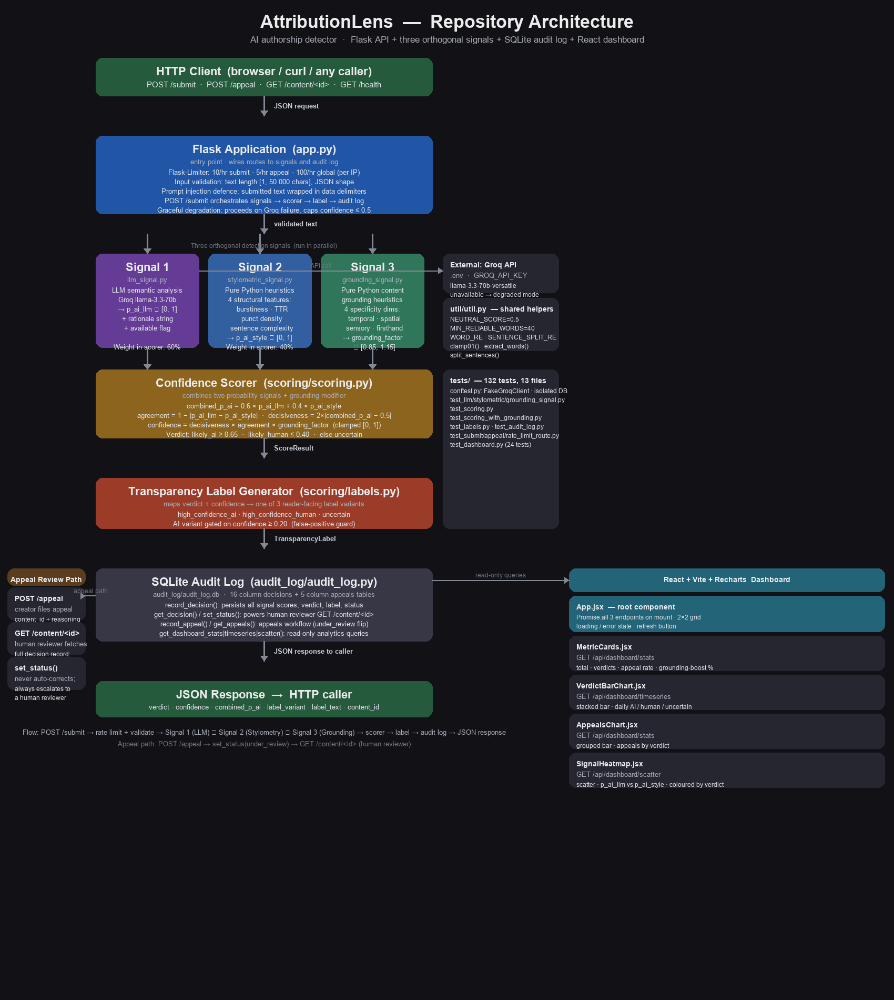
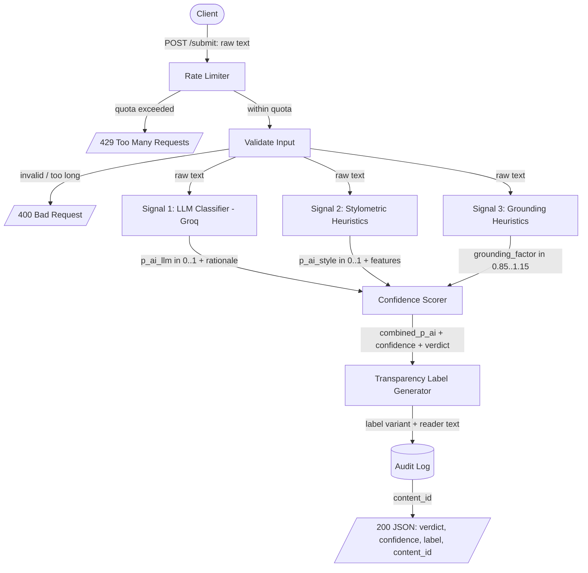
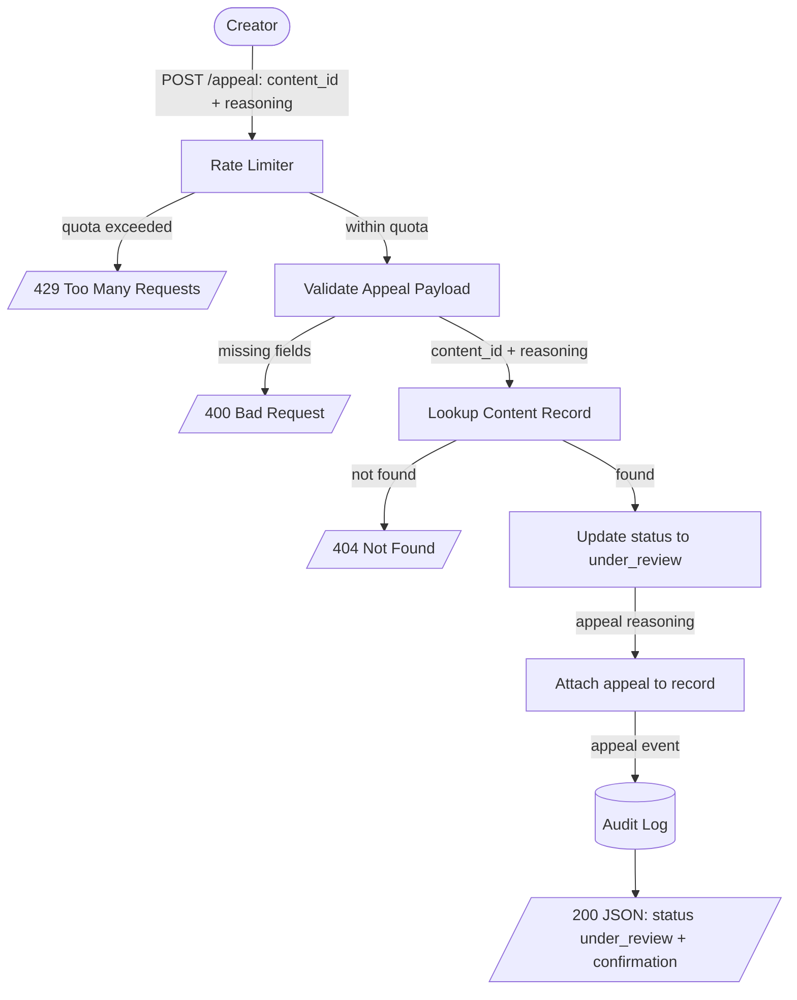
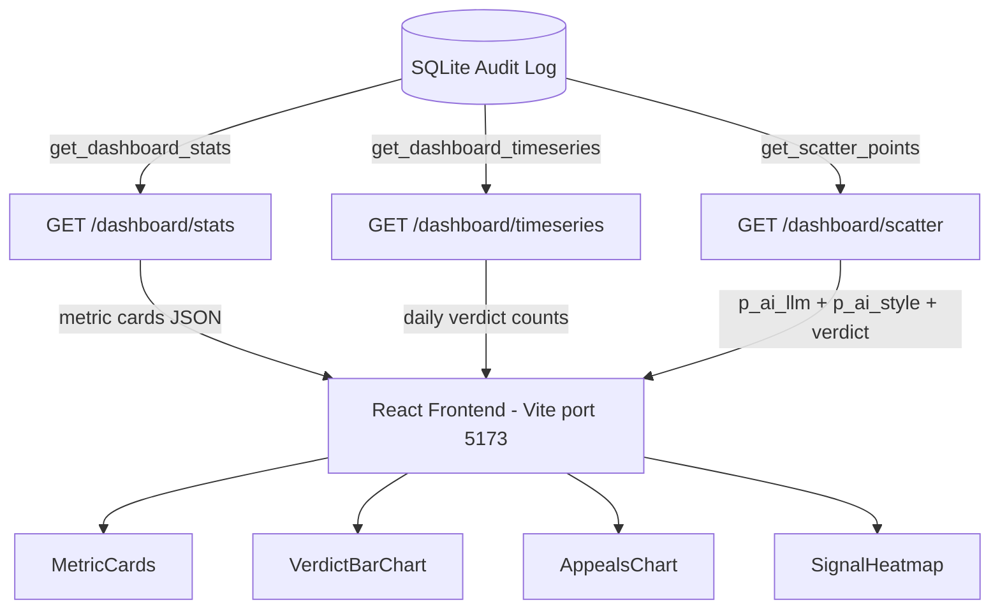

# AttributionLens

AttributionLens (Provenance Guard) is a backend service that any creative sharing platform can plug into to assess whether a piece of text-based content was written by a human or generated by AI. It does not police creativity. It produces an honest, uncertainty aware verdict, surfaces a plain language transparency label to readers, and gives creators a path to appeal a classification they believe is wrong.

The guiding principle of the entire design is asymmetric caution: on a writing platform, falsely labeling a human's work as AI generated is far more damaging than missing some AI generated text. Every threshold, label, and default in this system is biased toward that asymmetry.

---

## Table of Contents

1. [Architecture Overview](#1-architecture-overview)
2. [Architecture Diagrams](#2-architecture-diagrams)
3. [API Surface](#3-api-surface)
4. [Detection Signals](#4-detection-signals)
5. [Confidence Scoring](#5-confidence-scoring)
6. [Transparency Labels](#6-transparency-labels)
7. [Rate Limiting](#7-rate-limiting)
8. [Known Limitations](#8-known-limitations)
9. [Spec Reflection](#9-spec-reflection)
10. [AI Usage](#10-ai-usage)
11. [Appeals Workflow](#11-appeals-workflow)
12. [Audit Log](#12-audit-log)
13. [Analytics Dashboard](#13-analytics-dashboard)
14. [Test Suite](#14-test-suite)
15. [Setup and Launch](#15-setup-and-launch)

---

## 1. Architecture Overview

The repository is organized into a small set of focused modules, each owning a single responsibility. At the center is `app.py`, the Flask entry point that wires every module together and exposes the HTTP surface. Incoming requests pass through Flask-Limiter before reaching the core pipeline. The detection pipeline lives in the `signals/` directory: `llm_signal.py` calls Groq and returns a probability plus rationale, `stylometric_signal.py` runs pure Python structural heuristics, and `grounding_signal.py` measures experiential specificity. Outputs from those three modules flow into `scoring/scoring.py`, which combines them into a single `combined_p_ai` score and a `confidence` value, and then into `labels/labels.py`, which selects a reader-facing transparency label. Every decision and every appeal is persisted by `audit_log/audit_log.py` into a SQLite database (`attributionlens.db`). The `dashboard/` subdirectory holds a standalone React 18 and Vite frontend that talks to three dedicated Flask routes to render aggregate analytics. Supporting scripts in `util/` and `scripts/` handle tasks such as calibration checks and architecture diagram generation. Tests live in `tests/` and cover every module with unit and integration tests that run without any live credentials.

A single piece of text travels through the system as follows:

1. **Client submits** — A platform sends `POST /submit` with the raw text and an optional creator identifier.
2. **Rate limiter** — Flask-Limiter checks the caller against the per-endpoint quota. If the quota is exceeded the request stops here with a `429`.
3. **Input validation** — The service checks that the body is well-formed, that the text is present, and that it falls within the accepted length bounds. Malformed input stops here with a `400`.
4. **Signal 1: LLM classification** — The raw text is sent to Groq (`llama-3.3-70b-versatile`), which returns a probability that the text is AI generated plus a short rationale. This captures holistic semantic and stylistic coherence.
5. **Signal 2: Stylometric heuristics** — In parallel, pure Python heuristics compute measurable structural properties of the text (sentence length variance, vocabulary diversity, punctuation density) and map them to a probability that the text is AI generated. This captures statistical regularity, which differs from what the LLM sees.
6. **Signal 3: Grounding heuristics** — Also in parallel, pure Python heuristics measure experiential specificity: temporal anchors (clock times, dates, durations), spatial references (named locations, physical positions), sensory observations (smells, sounds, textures), and firsthand epistemic markers (I remember, when I was, my roommate). These are the content signals that distinguish text grounded in a specific human experience from text assembled through statistical synthesis. Signal 3 produces a `grounding_factor` in [0.85, 1.15] used as a confidence modifier rather than a third additive probability.
7. **Confidence scorer** — Signals 1 and 2 are combined into a single probability and a confidence value; Signal 3's grounding factor then modifies that confidence. Confidence rises when signals are decisive and in agreement; rich human provenance evidence boosts it further, and total absence of grounding on a borderline text reduces it slightly.
8. **Transparency label generator** — The combined score and confidence select one of three label variants (likely AI generated, likely human written, uncertain) and produce the exact reader-facing text.
9. **Audit log** — The decision is persisted as a structured record: content hash, all three raw signal scores, grounding factor, combined score, confidence, verdict, label variant, and timestamp.
10. **Response** — The service returns a structured JSON payload containing the verdict, confidence, label text, and the content ID the creator would later use to appeal.

The appeal path is shorter. A creator sends `POST /appeal` with the content ID and their reasoning. The service looks up the original decision, changes the content's status to `under_review`, attaches the appeal text to the record, writes an appeal event to the audit log, and returns a confirmation. Reclassification is intentionally not automated. A contested decision is escalated to a human, never silently overturned by the same system that made the original call.

Steps 4, 5, and 6 are deliberately independent. The LLM signal is semantic, the stylometric signal is structural, and the grounding signal is content-grounding; all three can run concurrently and fail independently. If Groq is unavailable, the system degrades to the stylometric and grounding signals alone and caps the confidence it is willing to report.

---

## 2. Architecture Diagrams

### Repository Architecture



### Submission flow



### Appeal flow



### Dashboard data flow



---

## 3. API Surface

The contract below is what every other component implements against.

### `POST /submit`

- **Accepts** — JSON body: `{ "text": "<string, required>", "creator_id": "<string, optional>" }`
- **Returns 200** —
  ```json
  {
    "content_id": "uuid",
    "verdict": "likely_ai | likely_human | uncertain",
    "combined_score": 0.0,
    "confidence": 0.0,
    "label": {
      "variant": "high_confidence_ai | high_confidence_human | uncertain",
      "text": "reader-facing label text"
    },
    "signals": {
      "llm": { "p_ai": 0.0, "rationale": "short string", "available": true },
      "stylometric": { "p_ai": 0.0, "features": { } },
      "grounding": { "grounding_factor": 1.0, "p_grounding_human": 0.0, "features": { } }
    },
    "status": "classified"
  }
  ```
- **Errors** — `400` invalid or out-of-bounds input, `429` rate limit exceeded, `503` if both signals fail.

### `POST /appeal`

- **Accepts** — JSON body: `{ "content_id": "<string, required>", "reasoning": "<string, required>", "creator_id": "<string, optional>" }`
- **Returns 200** — `{ "content_id": "uuid", "status": "under_review", "message": "confirmation text", "appeal_id": "uuid" }`
- **Errors** — `400` missing fields, `404` unknown `content_id`, `429` rate limit exceeded.

### `GET /content/<content_id>` (supporting endpoint)

- **Returns** — the stored decision record including current status and any attached appeals. This is what a human reviewer reads when working the appeal queue.

### `GET /health`

- **Returns** — `{ "status": "ok", "groq_available": true|false }`. Used for monitoring and to confirm whether the system is running in degraded (stylometry only) mode.

### Dashboard endpoints (Milestone 7)

| Route | Query params | Returns |
| --- | --- | --- |
| `GET /dashboard/stats` | none | Four metric card values: total submissions, verdict breakdown, appeal rate, pct boosted by grounding |
| `GET /dashboard/timeseries` | `days=N` (default 30) | Array of `{ date, likely_ai, likely_human, uncertain }` objects for the stacked bar chart |
| `GET /dashboard/scatter` | `limit=N` (default 500) | Array of `{ p_ai_llm, p_ai_style, verdict }` objects for the signal scatterplot |

---

## 4. Detection Signals

The system uses three genuinely distinct signals. Each measures a different axis: semantic/stylistic coherence, structural statistical properties, and content grounding specificity. They are informative in combination precisely because they fail in different ways and measure orthogonal properties.

### Signal 1 — LLM classification (Groq, `llama-3.3-70b-versatile`)

**What it measures** — Holistic semantic and stylistic coherence. The model is asked to assess whether the text reads as human written or AI generated and to return a probability plus a brief rationale. It captures patterns that no simple rule encodes: tonal flatness, generic phrasing, suspiciously even argument structure, the absence of lived specificity.

**Why this signal** — Current AI text tends toward a smooth, hedged, evenly weighted register. Human writing more often carries idiosyncrasy, abrupt shifts, specific concrete detail, and uneven emphasis. A large model has effectively internalized those distributional differences. No handcrafted rule can capture this reliably; only a model trained on the full distribution of both classes can.

**Output shape** — A probability `p_ai_llm` in `[0, 1]` and a short rationale string. The model is instructed to return a structured value so parsing is reliable.

**What it misses:**
- **Register bias (the critical false-positive source)** — LLM detectors systematically flag formal, polished, or academic prose as AI generated, even when a human genuinely writes that way. A meticulous essayist or a non-native speaker writing in careful, textbook correct English is exactly the kind of human most likely to be wrongly accused. This is the dominant failure mode on a writing platform and it is the one we engineer hardest against.
- **Non-determinism** — The same text can yield slightly different scores across calls. The verdict is not perfectly reproducible, which matters for auditability and fairness.
- **No ground-truth calibration** — The model emits a confident sounding number, but that number is not a calibrated probability. We treat it as one signal, never as the answer.
- **Adversarial limits** — It is weaker on text from models it has not seen much of, on heavily edited AI text, and on prompt injection attempts embedded in the submitted text itself.

### Signal 2 — Stylometric heuristics (pure Python)

**What it measures** — Measurable statistical structure of the text, independent of meaning. The implementation computes these features:
- **Sentence-length variance (burstiness)** — the spread of sentence lengths. Human writing tends to mix long and short sentences; AI writing is more uniform.
- **Type-token ratio** — vocabulary diversity, the ratio of unique words to total words. Captures repetition and lexical range.
- **Punctuation density and variety** — how often and how diversely punctuation is used. AI text often has flatter, more predictable punctuation.
- **Mean sentence complexity** — average words per sentence, used alongside variance so we measure variability rather than just length.

**Why this signal** — These are structural fingerprints rather than meaning. AI generation, sampling token by token toward high probability continuations, produces statistically smoother, lower variance output. Human composition is messier and more variable. The signal does not understand the text at all, which is exactly why it is not fooled by the register bias that trips the LLM. Running two signals that fail in orthogonal ways is the core of the false positive defense.

**Output shape** — A dictionary of raw feature values plus a single normalized probability `p_ai_style` in `[0, 1]`, derived by mapping each feature to the "AI-like" end of its expected range and combining.

**What it misses:**
- **Adversarially gameable** — Since the rules are explicit and deterministic, a knowledgeable user can defeat them on purpose. Manually varying sentence length, sprinkling in rare words, and diversifying punctuation will pull AI text toward the human end. The signal measures the symptom, not the cause, so the symptom can be faked.
- **Genre and form confusion** — It cannot tell intentional stylistic uniformity from AI uniformity. A minimalist poem, a list, song lyrics with a repeated refrain, or terse technical prose can all look "AI like" structurally while being entirely human.
- **Short-text instability** — Variance and type-token ratio are noisy and unreliable on very short inputs. Below a minimum length the signal carries little information.
- **No semantics** — It is blind to meaning, factual specificity, and tone, which is precisely the territory the LLM covers.

**Why the pairing works** — The LLM's worst failure (flagging careful human prose as AI) is structurally blind, and the stylometric signal, which sees only structure, will frequently disagree in those cases. That disagreement is not noise. It is signal. The confidence scorer treats disagreement between the two as evidence of uncertainty, which is the mechanism that protects the careful human writer from a false accusation.

### Signal 3 — Grounding heuristics (pure Python)

**What it measures** — Experiential specificity: whether the text shows evidence of originating from a specific human observation or memory chain. Four content-grounding dimensions:
- **Temporal specificity** — clock times (7:12 AM), calendar dates (March 4th), specific durations (twenty minutes).
- **Spatial specificity** — named locations, physical positioning (platform 4, back corner of the room).
- **Sensory observations** — smells, sounds, textures, colours used as direct observation (smelled like coffee, the seat was sticky).
- **First-hand epistemics** — markers of how knowledge was acquired (I remember, when I was, my roommate, I had no idea).

**Why this signal is orthogonal** — The independence test: two texts with similar stylometric statistics (uniform short sentences, restricted vocabulary) can produce very different grounding scores if one contains temporal anchors, named places, and sensory details while the other contains only abstract process statements. Stylometry sees both as structurally similar; grounding sees them as entirely different. The LLM signal also does not duplicate this: the LLM measures distributional similarity to AI generated text in aggregate, while grounding measures whether specific content evidence of human provenance is present.

**Output shape** — A `grounding_factor` in [0.85, 1.15] used as a confidence multiplier, a `p_grounding_human` probability in [0, 1] for audit log transparency, and a raw feature dict with per-dimension hit counts and subscores.

**What it misses:**
- **Genre neutrality** — Technical writing, philosophy, mathematics, and news articles often score near 0.5 (no strong evidence either way). Absence of grounding is not strong evidence of AI.
- **Regex-pattern limits** — Unconventional phrasings can be missed. Like stylometry, it measures symptoms.
- **Short-text instability** — Below 40 words the grounding features are too sparse; short text returns `grounding_factor = 1.0` (neutral).

**Signal reliability table:**

| Signal | Reliability | Explainability | Cost | Primary failure mode |
| --- | --- | --- | --- | --- |
| LLM (Signal 1) | Medium-High | Medium | External API | Register bias |
| Stylometric (Signal 2) | Medium | High | Cheap | Adversarially gameable |
| Grounding (Signal 3) | Low-Medium | High | Cheap | Genre neutrality |

**Why Signal 3 is a confidence modifier, not a third additive probability** — Signals 1 and 2 both estimate P(AI generated). Signal 3 asks a different question: is there affirmative evidence of human provenance? Absence of grounding is not strong evidence of AI for genre-neutral text, so treating it as a peer additive probability would increase false positives on technical writing. Using it as a confidence modifier means it can meaningfully tip borderline cases where the first two signals agree but evidence of human experience is absent, without dominating the verdict on text that is simply genre-neutral.

---

## 5. Confidence Scoring

A binary "AI / not AI" output would be dishonest, because perfect AI detection is an unsolved problem. The system therefore separates two distinct quantities:

- **`combined_p_ai`** — the system's best estimate of the probability that the text is AI-generated, in `[0, 1]`.
- **`confidence`** — how much trust to place in that estimate, in `[0, 1]`. This is what drives the user-facing label, and it is what an honest system must surface.

### Combining the signals

```
combined_p_ai   = w_llm * p_ai_llm + w_style * p_ai_style      (w_llm = 0.6, w_style = 0.4)
agreement       = 1 - abs(p_ai_llm - p_ai_style)               (in [0, 1])
decisiveness    = 2 * abs(combined_p_ai - 0.5)                  (in [0, 1]; 0 at the fence, 1 at the extremes)
confidence      = clamp01(decisiveness * agreement * grounding_factor)
```

where `grounding_factor` is the Signal 3 output in [0.85, 1.15] (default 1.0 when no grounding information changes the picture).

The LLM is weighted slightly higher (0.6) because it captures more of what actually distinguishes the two classes, but the stylometric signal is given real weight (0.4) so it can pull the verdict back when the LLM overly flags formal prose. Signal 3 then modifies confidence up (richly grounded text) or down (completely ungrounded borderline text) by up to 15%.

The `confidence` formula is the heart of the design. Confidence is high only when two conditions both hold: the combined estimate is far from the 0.5 fence (`decisiveness`), and the two independent signals agree (`agreement`). If the LLM says 0.9 AI but stylometry says 0.2 AI, agreement collapses to about 0.3 and confidence is dragged down regardless of where the combined score or grounding factor landed. The system then reports "uncertain" rather than gambling on a contested call.

### What a confidence value means to a reader

We decided what the number should mean to a user before deciding how to compute it. To a reader, confidence answers one question: how much should you trust this verdict?

- **`confidence` around 0.5 to 0.6** — The system is genuinely unsure. The label must say so plainly and must not assert a verdict the reader could mistake for fact.
- **`confidence` at 0.95** — The system is as sure as it gets, and the signals strongly agree. Even here the label uses "likely," never "definitely."

### Verdict bands (asymmetric on purpose)

The bands that map scores to labels are not symmetric around 0.5. Declaring "AI" is made hard; defaulting to "human" or "uncertain" is made easy. This is where the false positive asymmetry is encoded in code.

| Verdict | Condition | Rationale |
| --- | --- | --- |
| **likely_ai** | `combined_p_ai >= 0.65` AND `confidence >= 0.20` | A clear combined score is required before the system will accuse a creator. The confidence floor blocks verdicts where both signals are near the fence; it is intentionally low because the formula already embeds the cross-signal agreement penalty. |
| **likely_human** | `combined_p_ai <= 0.40` | The human zone is intentionally wide. Defaulting toward human is the safe error. |
| **uncertain** | everything else | The buffer band. It absorbs disagreement, weak signals, and the careful human prose false positive. |

The wide uncertain band is the safety net. Most ambiguous and adversarial cases land there by design, and the uncertain label is phrased so that landing there never reads as an accusation.

### How we validate the scores are meaningful

The scores are validated against a small fixture corpus, not just asserted to work.

- **Build labeled fixtures** — A set of known human texts (public domain literary excerpts, personal informal writing, deliberately formal/academic human writing) and known AI texts (passages generated by an LLM in several styles).
- **Check separation** — Confirm that known AI texts cluster at high `combined_p_ai` and known human texts cluster low, with the uncertain band in between rather than a hard flip at 0.5.
- **Stress the false positive directly** — Feed the formal/academic human samples through and confirm they do not cross into `likely_ai`. The acceptance bar is that the formal human samples land in `uncertain` or `likely_human`, never in `likely_ai`. We tune thresholds to minimize the "human-as-AI" rate even at the cost of catching less actual AI text.
- **Check the disagreement mechanism** — Construct a case where the signals disagree and confirm confidence drops and the verdict moves to `uncertain`.

**Calibration results (4 fixtures)** — After recalibration, known AI text scored `combined = 0.66` versus known human text at `combined = 0.13`, clear separation. The clearly-AI fixture lands in `uncertain` rather than `likely_ai` because its sentence length variance reads as structurally human to the stylometric signal, causing the signals to disagree and confidence to collapse. This is the asymmetric caution design working correctly: `likely_ai` requires decisive agreement from both signals, not just a high combined score.

---

## 6. Transparency Labels

The label is what a non-technical reader actually sees. It must communicate the verdict in plain language and make the confidence level meaningful without exposing a raw number the reader cannot interpret. No raw probabilities are shown to readers. A "0.62" means nothing to a non-technical user and invites false precision. The three named states carry the meaning instead.

### Variant A — High Confidence AI (`verdict = likely_ai`, `confidence >= 0.65`)

```
AI generated content likely
Our analysis suggests this text was probably created with significant help from an AI tool.
This is an automated estimate, not a certainty. The creator can contest it.
```

### Variant B — High Confidence human (`verdict = likely_human`)

```
Likely human written
Our analysis found no strong signs of AI generation in this text.
This is an automated estimate and is not a guarantee.
```

### Variant C — Uncertain (`verdict = uncertain`, or any low confidence result)

```
Attribution uncertain
We could not confidently determine whether this text was written by a person or generated
with AI. Please treat this as incomplete context rather than a verdict about the creator.
```

**Design notes:**
- Every variant hedges. Even the AI variant says "likely" and "probably," and every variant names that it is automated and contestable.
- The uncertain variant never accuses. It reframes the result as missing context, which is the truthful framing when the signals disagree or are weak.
- The AI variant is gated on `confidence >= 0.65`. A `likely_ai` verdict arriving below that floor falls back to `uncertain` automatically.

---

## 7. Rate Limiting

Limits are enforced per caller (IP address, or API key in a real integration) using Flask-Limiter.

| Endpoint | Limit | Reasoning |
| --- | --- | --- |
| `POST /submit` | **10 per hour, 30 per day** | A real creator submits a handful of pieces at most in a sitting. Ten per hour comfortably covers genuine bursts (revising and resubmitting a piece) while 30 per day caps sustained abuse. Each submission triggers a paid/limited Groq call, so this limit also protects the upstream free-tier quota and blunts cost abuse and scraping. |
| `POST /appeal` | **5 per hour** | Appeals are rare, human-driven, and deliberate. A legitimate creator almost never files several appeals an hour. A low ceiling here stops appeal spam against the human review queue without ever obstructing a real grievance. |
| Global default | **100 per hour** | A backstop covering supporting endpoints (`/content`, `/health`) so no single caller can saturate the service even within per-endpoint limits. |

**Threat model behind the numbers** — The adversary we care about is someone scripting the endpoint to flood the system, either to exhaust the Groq quota and deny service to real users, or to scrape detection behavior. The legitimate user we must never block is a creator iterating on one piece of writing. The chosen values sit comfortably above realistic human use and well below what a flooding script would need.

---

## 8. Known Limitations

Two specific content types this system will likely misclassify, and why.

**Highly repetitive or formally constrained poetry** — A poem built on a repeated refrain, deliberately simple vocabulary, and uniform line lengths (for example a villanelle or a chant-like piece) presents exactly the low variance, low diversity structural fingerprint the stylometric signal reads as AI. The root cause is a property of the signal itself: sentence-length variance and type-token ratio are computed over raw token counts, with no awareness of intentional artistic constraint. A poem using the same refrain ten times is indistinguishable from AI output to the heuristic, even though repetition is the point. The wide uncertain band and the disagreement mechanism mitigate this, but constrained poetry is a genuine weak spot and may surface as `uncertain` when it is plainly human.

**Careful formal or non-native English prose** — Polished academic writing and the careful, grammatically meticulous English of many non-native speakers trip the LLM's register bias toward "AI." This is the false positive we engineer against in the confidence scoring design, and the system is designed to route these to `uncertain` rather than `likely_ai`. But it remains the category most at risk of an unfair call and the one most likely to generate appeals. The LLM signal has no way to distinguish "human who writes like a textbook" from "AI that writes like a textbook" because the distributional pattern is the same to the model in both cases.

Other acknowledged limits: very short text starves the stylometric signal; a knowledgeable adversary can hand-tune AI text to defeat the heuristics; and the LLM signal is non-deterministic, so a borderline verdict is not perfectly reproducible.

---

## 9. Spec Reflection

**Where the spec accelerated implementation.** The confidence formula was written out as explicit arithmetic before any code existed. When Claude Code generated `scoring.py`, it had a concrete equation to implement rather than a prose description of intent, so the first draft matched the acceptance tests almost exactly. The only manual check needed was confirming the floating-point arithmetic matched the hand computed examples in the false positive walkthrough. Having the formula in the spec turned a design decision into a mechanical transcription, which is where specs provide the clearest leverage.

**Where implementation diverged from the plan.** The spec originally stated that an unavailable Groq client returns `503` when both signals fail. During Milestone 4, Signal 2 (stylometry) was made always available by design (it is pure Python with no external dependency), which made the original `503` path unreachable under normal operation. The degraded path was redefined: if Groq is unavailable, the system proceeds on stylometry alone and caps confidence at 0.5. The `503` is now reserved for the genuinely unreachable case where both signals fail simultaneously. Tests that previously asserted the old `503` behavior were updated to match. The divergence was driven by a real implementation constraint discovered in code, not a spec error, but the spec's original `503` definition was no longer accurate and had to be overridden.

---

## 10. AI Usage

**Instance 1 — Stylometric signal and calibration.** Claude Code was given the Signal 2 description (features and normalized `p_ai_style` output) and asked to implement `signals/stylometric_signal.py` with the four specified features. The first draft was correct in structure but had a silent calibration error: the type-token ratio band was set for long texts (`[0.4, 0.7]`), so short submissions saturated silently to a subscore of 0.0 because short submissions have TTR in the range 0.86 to 0.90 (few words leaves little chance to repeat). This was caught via `scripts/calibration_check.py`. The band was recalibrated to `[0.55, 0.92]` and a regression guard test (`test_ttr_subscore_not_silently_pinned_on_short_text`) was added manually. The AI produced the correct shape; the calibration required manual verification against real fixture data before it was trustworthy.

**Instance 2 — Appeals endpoint.** Claude Code was given the Appeals Workflow and Audit Log sections and asked to implement `POST /appeal` and extend the audit log schema. The first draft accepted either `reasoning` or `creator_reasoning` as the appeal field without being asked to, which turned out to match the test suite. One revision was needed: the original draft did not attach the appeal record to the decision row in a way that was queryable through the existing `/log` endpoint. The audit log schema was adjusted so that `appeal_filed`, `appeal_reasoning`, and `appeal_id` are surfaced as columns on the decision row rather than as a separate lookup, keeping the reviewer view simple. This override prioritized the human reviewer's workflow (one record, all context) over the more normalized schema the AI defaulted to.

---

## 11. Appeals Workflow

- **Who can appeal** — Any creator who received a `content_id` from a `/submit` call. In a real platform integration the platform would authenticate the creator; for this project the `content_id` plus optional `creator_id` is the handle.
- **What they provide** — The `content_id` of the contested decision and a free text `reasoning` explaining why they believe the classification is wrong. Reasoning is required; an appeal with no explanation is rejected with a `400`.
- **What the system does on receipt** —
  1. Validates the payload and looks up the original decision record. Unknown `content_id` returns `404`.
  2. Changes the content's status from `classified` to `under_review`.
  3. Attaches the appeal (its own `appeal_id`, the reasoning, the timestamp, and optional `creator_id`) to the content record.
  4. Writes an `appeal` event to the audit log, linked to the original decision by `content_id`.
  5. Returns a confirmation that the appeal was received and the content is now under review.
- **Re-classification is deliberately not automated.** The same pipeline that may have erred should not adjudicate its own error. An appeal escalates to a human.
- **What a human reviewer sees** — Via `GET /content/<content_id>`, the reviewer sees the full picture in one place: the original verdict, both raw signal scores, the LLM rationale, the combined score and confidence, the label that was shown, the current status, and the creator's appeal reasoning with timestamps. That is enough context to make an informed human decision without re-running anything.

---

## 12. Audit Log

Every decision and every appeal is captured as a structured record. The store is SQLite (a `decisions` table and an `appeals` table), which gives durable, queryable, structured logging with no extra setup.

**Decision record fields**

| Field | Description |
| --- | --- |
| `content_id` | UUID primary key, returned to the creator and used for appeals. |
| `content_hash` | Hash of the submitted text, for dedup and to avoid storing raw content verbatim where not needed. |
| `creator_id` | Optional creator handle. |
| `p_ai_llm` | Signal 1 raw probability. |
| `llm_rationale` | Short LLM rationale string. |
| `llm_available` | Whether the LLM signal ran (false in degraded mode). |
| `p_ai_style` | Signal 2 raw probability. |
| `style_features` | JSON of the computed stylometric features. |
| `p_grounding_human` | Signal 3 grounding probability in [0, 1]. |
| `grounding_features` | JSON of the grounding feature hit counts and subscores. |
| `grounding_factor` | Signal 3 confidence modifier in [0.85, 1.15]. |
| `combined_score` | Final combined probability. |
| `confidence` | Final confidence value. |
| `verdict` | `likely_ai` / `likely_human` / `uncertain`. |
| `label_variant` | Which of the three label variants was shown. |
| `status` | `classified` / `under_review`. |
| `created_at` | Timestamp. |

**Appeal record fields**

| Field | Description |
| --- | --- |
| `appeal_id` | UUID primary key. |
| `content_id` | Foreign key linking to the contested decision. |
| `creator_id` | Optional creator handle. |
| `reasoning` | The creator's free-text explanation. |
| `created_at` | Timestamp. |

The log is the single source of truth for the demo (at least three decision entries will be visible) and for any human reviewer working the appeal queue.

---

## 13. Analytics Dashboard

Milestone 7 added a read-only analytics dashboard that visualizes aggregate detection patterns across all stored decisions. It consists of three new Flask query functions, three new API routes, and a React 18 frontend served by Vite.

### Backend additions

**`audit_log/audit_log.py`** gained three query functions:

| Function | Purpose |
| --- | --- |
| `get_dashboard_stats()` | Computes all four principal metrics in a single DB pass |
| `get_dashboard_timeseries(days)` | Groups decisions by calendar date and verdict for the stacked bar chart |
| `get_scatter_points(limit)` | Returns one `(p_ai_llm, p_ai_style, verdict)` row per submission for the scatterplot |

The grounding influence calculation inside `get_dashboard_stats` reconstructs `base_confidence = decisiveness * agreement` from the stored `combined_score`, `p_ai_llm`, and `p_ai_style` columns, then computes `confidence_delta = final_confidence - base_confidence`. This is the correct way to reverse engineer Signal 3's contribution from already persisted data without re-running the scorer.

`audit_log/__init__.py` re-exports the three new functions so `app.py`'s `from audit_log import ...` style works unchanged.

**`app.py`** gained three new routes with CORS enabled via `flask-cors`:

| Route | What it serves |
| --- | --- |
| `GET /dashboard/stats` | All four metric cards |
| `GET /dashboard/timeseries?days=N` | Detection pattern bar chart data |
| `GET /dashboard/scatter?limit=N` | Signal agreement scatterplot data |

### Frontend (dashboard/)

Architecture: React 18 + Vite + Recharts. The Vite proxy in `vite.config.js` rewrites `/api/*` to `http://localhost:5000/*`, so all fetch calls in the app use relative `/api/...` URLs and work without any manual CORS handling on the client.

| File | Chart type | Data source |
| --- | --- | --- |
| `MetricCards.jsx` | 4 summary cards | `/dashboard/stats` |
| `VerdictBarChart.jsx` | Stacked bar (per day) | `/dashboard/timeseries` |
| `AppealsChart.jsx` | Grouped bar | `/dashboard/stats` |
| `SignalHeatmap.jsx` | Scatterplot | `/dashboard/scatter` |

`App.jsx` fires all three fetches in parallel with `Promise.all` on mount and on each Refresh click. Each chart gets its own independent loading/error state, so a slow scatter query does not block the metric cards from rendering.

`SignalHeatmap` uses a custom `VerdictDot` shape renderer because Recharts `Scatter` does not natively color individual dots by a data field. The renderer reads each point's `verdict` field and picks the right CSS variable color. The diagonal `ReferenceLine` (from (0,0) to (1,1)) marks perfect signal agreement; dots far from it are the high disagreement cases that collapse confidence and route to `uncertain`, making the architecture's safety mechanism visible at a glance.

### Dashboard tests

`tests/test_dashboard.py` adds 24 tests in three categories:

- **Empty database** — all three routes return HTTP 200 with zero/empty values rather than errors. This validates graceful degradation for a fresh install.
- **Correctness after known submissions** — total counts match the number of `_submit` calls, verdict counts sum to total, appeal rate equals `appeals_filed / total`, scatter `limit` parameter is respected.
- **Shape contracts** — every response key the frontend depends on (`p_ai_llm`, `p_ai_style`, `verdict`, `date`, `pct_boosted`, etc.) is asserted present in each response.

---

## 14. Test Suite

The `tests/` directory contains 132 tests across 13 files. Every module with nontrivial logic has a corresponding unit test file. Integration tests cover the full request path from HTTP request to audit row. Tests run with `pytest` from the project root; no environment variables or live Groq credentials are required because all LLM calls are replaced by in-process fakes.

```
tests/
  conftest.py                         # FakeGroqClient, isolated SQLite fixture, Flask test client
  helpers.py                          # stub_llm() monkeypatch utility
  test_llm_signal.py                  # Signal 1 unit tests
  test_stylometric_signal.py          # Signal 2 unit tests (includes TTR regression guard)
  test_grounding_signal.py            # Signal 3 unit tests (contract, separation, independence, per-feature)
  test_scoring.py                     # Confidence formula, verdict bands, degraded mode
  test_scoring_with_grounding.py      # Signal 3 integration: modifier arithmetic, clamping, safety
  test_audit_log.py                   # Audit log round-trip and field shape tests
  test_submit_route.py                # POST /submit integration tests
  test_audit_captures_both_signals.py # Milestone 4 checkpoint: both signals persist to DB
  test_labels.py                      # Label variant text and gating tests
  test_appeal_route.py                # POST /appeal and GET /content integration tests
  test_rate_limit.py                  # 429 behavior tests
  test_dashboard.py                   # 24 dashboard route tests (empty DB, correctness, shape contracts)
```

---

## 15. Setup and Launch

### Prerequisites

- **Python 3.11+**
- **Node.js 20+ and npm** — required for the React dashboard. Download from [nodejs.org](https://nodejs.org/) (LTS recommended). After installing, open a new terminal and verify with `node --version` and `npm --version`.
- **A Groq API key** — free tier available at [console.groq.com](https://console.groq.com/). The service runs in degraded mode (stylometry only, confidence capped at 0.5) if the key is absent or Groq is unreachable.

---

### Step 1: Configure your Groq API key

Create a `.env` file in the project root (next to `app.py`):

**Windows (PowerShell)**
```powershell
New-Item .env -ItemType File
Add-Content .env "GROQ_API_KEY=gsk_your_key_here"
```

**Mac / Linux**
```bash
echo "GROQ_API_KEY=gsk_your_key_here" > .env
```

Replace `gsk_your_key_here` with your actual key. The `.env` file is already in `.gitignore` and will not be committed.

---

### Step 2: Install Python dependencies

**Windows (PowerShell)**
```powershell
python -m venv .venv
.venv\Scripts\Activate.ps1
pip install -r requirements.txt
```

**Mac / Linux**
```bash
python3 -m venv .venv
source .venv/bin/activate
pip install -r requirements.txt
```

---

### Step 3: Start the Flask backend

With the virtual environment active:

```bash
python app.py
```

Flask listens on `http://localhost:5000`. Leave this terminal running.

---

### Step 4: Generate sample data (optional but recommended)

The dashboard is most interesting with real submissions. Open a second terminal and run one of the following.

**Using the included demo script**

```bash
# Mac / Linux
bash demo.sh

# Windows (Git Bash or WSL)
bash demo.sh
```

**Or submit a single entry manually**

```bash
curl -s -X POST http://localhost:5000/submit \
  -H "Content-Type: application/json" \
  -d '{"text": "I remember the exact moment I realized something was wrong with the experiment. It was 7:14 AM on a Tuesday and the lab smelled faintly of burnt plastic."}'
```

Repeat with a few different texts to populate the charts.

---

### Step 5: Install Node dependencies and start the React frontend

Open a third terminal (no virtual environment needed):

**Windows (PowerShell)** — if `npm` is not recognized, add Node to your PATH first:
```powershell
$env:PATH += ";C:\Program Files\nodejs"
cd dashboard
npm install
npm run dev
```

**Mac / Linux**
```bash
cd dashboard
npm install
npm run dev
```

Vite listens on `http://localhost:5173`. Open that URL in a browser to see the dashboard.

---

### Step 6: Run the tests

With the virtual environment active and from the project root:

```bash
pytest
```

No live Groq credentials are required. All LLM calls are replaced by deterministic fakes. All 132 tests should pass.

---

### Permanent PATH fix for Node on Windows

If you want `npm` to work in every new terminal without the `$env:PATH` workaround:

1. Search "Environment Variables" in the Start menu.
2. Under System Variables, find `Path` and click Edit.
3. Click New and add `C:\Program Files\nodejs`.
4. Click OK and restart any open terminals.
