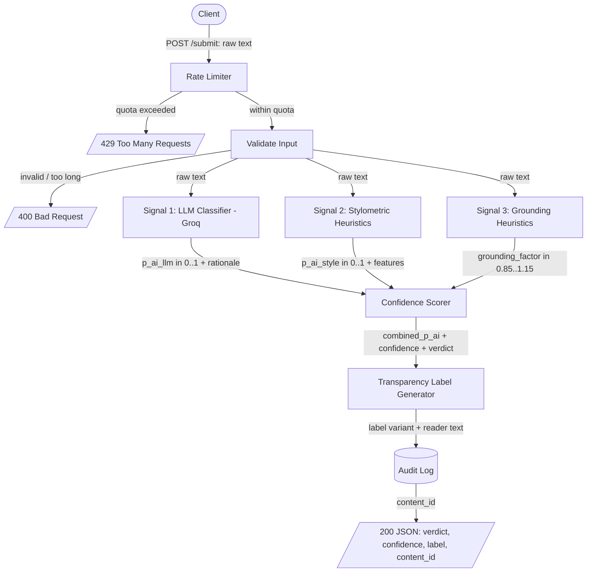
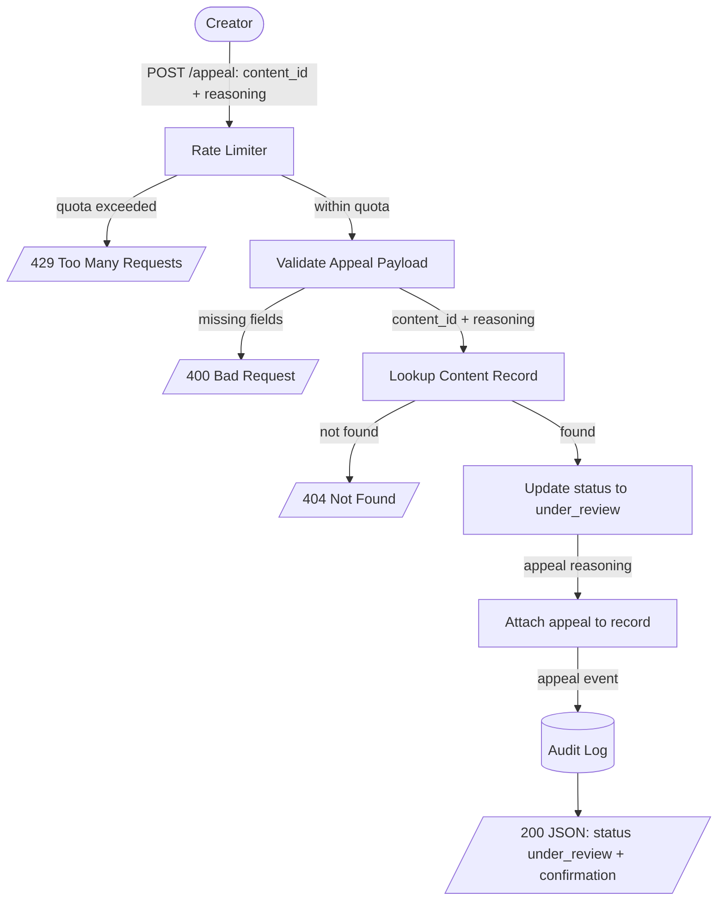
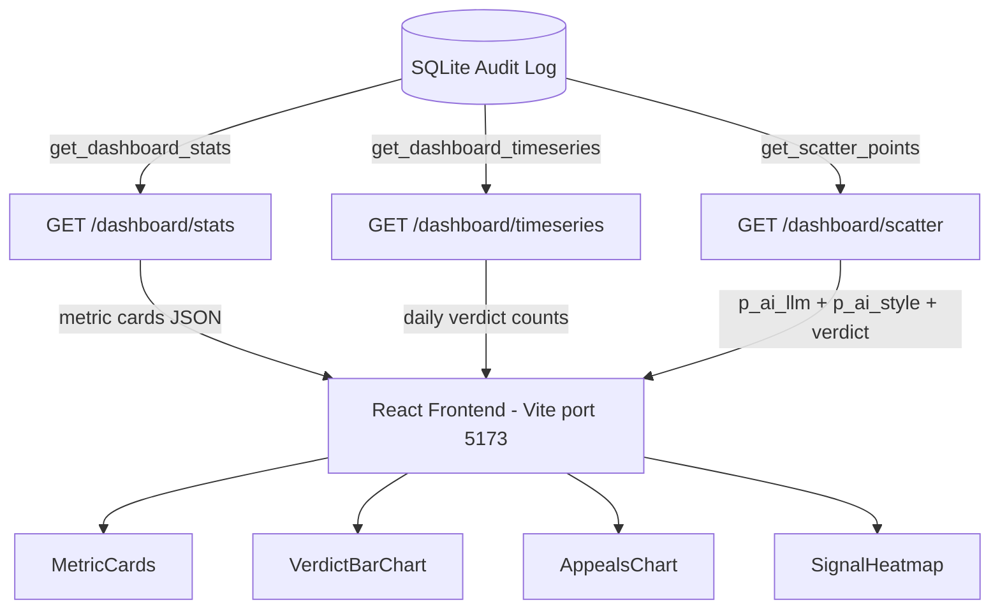

# AttributionLens (Provenance Guard) — Planning & Specification

AttributionLens (Provenance Guard) is a backend service that any creative sharing platform can plug into to assess whether a piece of text-based content was written by a human or generated by AI. It does not police creativity. It produces an honest, uncertainty aware verdict, surfaces a plain language transparency label to readers, and gives creators a path to appeal a classification they believe is wrong.

The guiding principle of the entire design is asymmetric caution: on a writing platform, falsely labeling a human's work as AI generated is far more damaging than missing some AI generated text. Every threshold, label, and default in this system is biased toward that asymmetry.

---

## 1. Architecture Overview (the path a submission takes)

A single piece of text travels through the system as follows:

1. **Client submits** — A platform sends `POST /submit` with the raw text and an optional creator identifier.
2. **Rate limiter** — Flask-Limiter checks the caller against the per-endpoint quota. If the quota is exceeded the request stops here with a `429`.
3. **Input validation** — The service checks that the body is well-formed, that the text is present, and that it falls within the accepted length bounds. Malformed input stops here with a `400`.
4. **Signal 1: LLM classification** — The raw text is sent to Groq (`llama-3.3-70b-versatile`), which returns a probability that the text is AI generated plus a short rationale. This captures holistic semantic and stylistic coherence.
5. **Signal 2: Stylometric heuristics** — In parallel, pure Python heuristics compute measurable structural properties of the text (sentence length variance, vocabulary diversity, punctuation density) and map them to a probability that the text is AI generated. This captures statistical regularity, which differs from what the LLM sees.
6. **Signal 3: Grounding heuristics** — Also in parallel, pure Python heuristics measure experiential specificity: whether the text contains concrete temporal anchors, named spatial references, sensory observations, or firsthand epistemic markers. This measures a different axis from both Signals 1 and 2 (see Section 4). It returns a `grounding_factor` in [0.85, 1.15] used as a confidence modifier rather than a third additive probability.
7. **Confidence scorer** — Signals 1 and 2 are combined into a single probability and a confidence value; the grounding factor from Signal 3 then modifies that confidence up or down. Confidence rises when signals are decisive and in agreement; Signal 3 can amplify or dampen that confidence based on experiential evidence.
8. **Transparency label generator** — The combined score and confidence select one of three label variants (likely AI generated, likely human written, uncertain) and produce the exact reader-facing text.
9. **Audit log** — The decision is persisted as a structured record: content hash, all three raw signal scores, grounding factor, combined score, confidence, verdict, label variant, and timestamp.
10. **Response** — The service returns a structured JSON payload containing the verdict, confidence, label text, and the content ID the creator would later use to appeal.

The appeal path is shorter. A creator sends `POST /appeal` with the content ID and their reasoning. The service looks up the original decision, changes the content's status to `under_review`, attaches the appeal text to the record, writes an appeal event to the audit log, and returns a confirmation. Reclassification is intentionally not automated. A contested decision is escalated to a human, never silently overturned by the same system that made the original call.

Steps 4, 5, and 6 are deliberately independent. The LLM signal is semantic, the stylometric signal is structural, and the grounding signal is content-grounding; all three can run concurrently and fail independently. If Groq is unavailable, the system degrades to the stylometric and grounding signals alone and caps the confidence it is willing to report (see Section 9).

---

## 2. Architecture Diagrams

### Submission flow



### Appeal flow



### Dashboard data flow



---

## 3. API Surface

The contract below is what every other component implements against.

### `POST /submit`

- **Accepts** — JSON body: `{ "text": "<string, required>", "creator_id": "<string, optional>" }`
- **Returns 200** —
  ```json
  {
    "content_id": "uuid",
    "verdict": "likely_ai | likely_human | uncertain",
    "combined_score": 0.0,
    "confidence": 0.0,
    "label": {
      "variant": "high_confidence_ai | high_confidence_human | uncertain",
      "text": "reader-facing label text"
    },
    "signals": {
      "llm": { "p_ai": 0.0, "rationale": "short string", "available": true },
      "stylometric": { "p_ai": 0.0, "features": { } }
    },
    "status": "classified"
  }
  ```
- **Errors** — `400` invalid or out-of-bounds input, `429` rate limit exceeded, `503` if both signals fail.

### `POST /appeal`

- **Accepts** — JSON body: `{ "content_id": "<string, required>", "reasoning": "<string, required>", "creator_id": "<string, optional>" }`
- **Returns 200** — `{ "content_id": "uuid", "status": "under_review", "message": "confirmation text", "appeal_id": "uuid" }`
- **Errors** — `400` missing fields, `404` unknown `content_id`, `429` rate limit exceeded.

### `GET /content/<content_id>` (supporting endpoint)

- **Returns** — the stored decision record including current status and any attached appeals. This is what a human reviewer reads when working the appeal queue.

### `GET /health`

- **Returns** — `{ "status": "ok", "groq_available": true|false }`. Used for monitoring and to confirm whether the system is running in degraded (stylometry only) mode.

### Dashboard endpoints (Milestone 7)

| Route | Query params | Returns |
| --- | --- | --- |
| `GET /dashboard/stats` | none | Four metric card values: total submissions, verdict breakdown, appeal rate, pct boosted by grounding |
| `GET /dashboard/timeseries` | `days=N` (default 30) | Array of `{ date, likely_ai, likely_human, uncertain }` objects for the stacked bar chart |
| `GET /dashboard/scatter` | `limit=N` (default 500) | Array of `{ p_ai_llm, p_ai_style, verdict }` objects for the signal scatterplot |

---

## 4. Detection Signals

The system uses three genuinely distinct signals. Each measures a different axis of the text: semantic/stylistic coherence, structural statistical properties, and content-grounding specificity. They are informative in combination precisely because they fail in different ways and measure orthogonal properties.

### Signal 1 — LLM classification (Groq, `llama-3.3-70b-versatile`)

- **What it measures** — Holistic semantic and stylistic coherence. The model is asked to assess whether the text reads as human written or AI generated and to return a probability plus a brief rationale. It captures patterns that no simple rule encodes: tonal flatness, generic phrasing, suspiciously even argument structure, the absence of lived specificity.
- **Why that property differs between human and AI** — Current AI text tends toward a smooth, hedged, evenly weighted register. Human writing more often carries idiosyncrasy, abrupt shifts, specific concrete detail, and uneven emphasis. A large model has effectively internalized those distributional differences.
- **Output shape** — A probability `p_ai_llm` in `[0, 1]` and a short rationale string. We instruct the model to return a structured value so parsing is reliable.
- **Blind spots** —
  - **Register bias (the critical false-positive source)** — LLM detectors systematically flag formal, polished, or academic prose as AI generated, even when a human genuinely writes that way. A meticulous essayist or a non-native speaker writing in careful, textbook correct English is exactly the kind of human most likely to be wrongly accused. This is the dominant failure mode on a writing platform and it is the one we engineer the hardest against.
  - **Non-determinism** — The same text can yield slightly different scores across calls. The verdict is not perfectly reproducible, which matters for auditability and for fairness.
  - **No ground truth and no calibration of its own** — The model emits a confident sounding number, but that number is not a calibrated probability. We treat it as one signal, never as the answer.
  - **Adversarial and training-data limits** — It is weaker on text from models it has not seen much of, on heavily edited AI text, and on prompt-injection attempts embedded in the submitted text itself.

### Signal 2 — Stylometric heuristics (pure Python)

- **What it measures** — Measurable statistical structure of the text, independent of meaning. The implementation computes at least these features:
  - **Sentence-length variance (burstiness)** — the spread of sentence lengths. Human writing tends to mix long and short sentences; AI writing is more uniform.
  - **Type-token ratio** — vocabulary diversity, the ratio of unique words to total words. Captures repetition and lexical range.
  - **Punctuation density and variety** — how often and how diversely punctuation is used. AI text often has flatter, more predictable punctuation.
  - **Mean sentence complexity** — average words per sentence, used alongside variance so we measure variability rather than just length.
- **Why those properties differ between human and AI** — These are structural fingerprints rather than meaning. AI generation, sampling token by token toward high-probability continuations, produces statistically smoother, lower-variance output. Human composition is messier and more variable. The signal does not understand the text at all, which is exactly why it is not fooled by the register bias that trips the LLM.
- **Output shape** — A dictionary of raw feature values plus a single normalized probability `p_ai_style` in `[0, 1]`, derived by mapping each feature to the "AI-like" end of its expected range and combining.
- **Blind spots** —
  - **Adversarially gameable** — Because the rules are explicit and deterministic, a knowledgeable user can defeat them on purpose. Manually varying sentence length, sprinkling in rare words, and diversifying punctuation will pull AI text toward the human end. The signal measures the symptom, not the cause, so the symptom can be faked.
  - **Genre and form confusion** — It cannot tell intentional stylistic uniformity from AI uniformity. A minimalist poem, a list, song lyrics with a repeated refrain, or terse technical prose can all look "AI like" structurally while being entirely human.
  - **Short-text instability** — Variance and type-token ratio are noisy and unreliable on very short inputs. Below a minimum length the signal carries little information.
  - **No semantics** — It is blind to meaning, factual specificity, and tone, which is precisely the territory the LLM covers.

**Why the pairing works** — The LLM's worst failure (flagging careful human prose as AI) is structural blind, and the stylometric signal, which sees only structure, will frequently disagree in those cases. That disagreement is not noise. It is signal. The confidence scorer in Section 5 treats disagreement between the two as evidence of uncertainty, which is the mechanism that protects the careful human writer from a false accusation.

### Signal 3 — Grounding heuristics (pure Python)

- **What it measures** — Experiential specificity: whether the text contains evidence of originating from a genuine chain of human experience, memory, or observation rather than from statistical synthesis. Specifically it measures four content-grounding dimensions:
  - **Temporal specificity** — concrete clock times (7:12 AM), calendar dates (March 4th), specific durations (twenty minutes). These are the kinds of anchors that come from episodic memory.
  - **Spatial specificity** — named locations, physical positioning language (platform 4, the back corner of the room). A writer who was actually somewhere records it.
  - **Sensory observations** — smells, sounds, textures, colours used as direct observation (smelled like coffee, the seat was sticky). AI text omits these because they are not informationally efficient for generic prose.
  - **First-hand epistemics** — phrases that communicate how knowledge was acquired (I remember, when I was, my friend, I had no idea). These mark information as personally witnessed rather than generally synthesised.
- **Why this signal is genuinely orthogonal** — The key independence test: could two texts have identical stylometric statistics but very different grounding scores? Yes. A text with uniform short sentences and restricted vocabulary (AI-leaning by stylometry) can be full of timestamps, named places, and sensory observations (high grounding). The two signals measure orthogonal axes. The grounding signal also does not overlap with the LLM signal: the LLM measures holistic distributional similarity to AI-generated text, while grounding measures whether specific content evidence of human provenance is present. The three signals ask three distinct questions: "Does this resemble AI language?", "Does this have AI-like statistical structure?", and "Does this contain evidence of a specific human experience?"
- **Why it is a confidence modifier, not a third additive probability** — The grounding signal answers a fundamentally different question from Signals 1 and 2. Signals 1 and 2 both estimate P(AI generated). Signal 3 asks whether there is affirmative evidence of human provenance. Absence of grounding is not strong evidence of AI: a technical specification, a philosophy essay, or a mathematical proof may contain zero temporal anchors or sensory observations while being entirely human-written. This makes grounding naturally suited to modifying confidence (how certain the system is) rather than directly shifting P(AI). Rich grounding should increase confidence that the system is correct about a human verdict; total absence of grounding on a borderline text should reduce confidence slightly.
- **Output shape** — A `grounding_factor` in [0.85, 1.15] passed to the confidence scorer as a multiplier, a `p_grounding_human` probability in [0, 1] for audit log transparency, and a raw feature dict with hit counts and per-dimension subscores.
- **Blind spots** —
  - **Genre neutrality** — Technical writing, philosophy, mathematics, and news articles may score near 0.5 by design (no strong grounding signals either way). The signal is most informative on personal narratives, memoir-style prose, and informal writing. Absence of grounding is never treated as strong evidence of AI.
  - **Pattern matching limits** — The regex-based feature extraction can miss unconventional phrasings and can be defeated by someone who knows the patterns. Like stylometry it measures symptoms, not causes.
  - **Short-text instability** — Below 40 words the grounding features are too sparse to be reliable. Short text returns `grounding_factor = 1.0` (neutral), consistent with the stylometric signal's fence logic.

**Signal reliability table** — The three signals have different reliability profiles and failure modes:

| Signal | Reliability | Explainability | Cost | Primary failure mode |
| --- | --- | --- | --- | --- |
| LLM (Signal 1) | Medium-High | Medium | External API | Register bias (flags formal human prose) |
| Stylometric (Signal 2) | Medium | High | Cheap | Adversarially gameable; genre confusion |
| Grounding (Signal 3) | Low-Medium | High | Cheap | Genre neutrality; not universal evidence |

**Weighting rationale** — Signal 3 is weighted at 15% of effective influence as a confidence modifier in [0.85, 1.15]. This reflects its lower and more genre-dependent reliability: it can meaningfully tip borderline cases when rich grounding is present, but its absence on technical or abstract writing should not substantially penalise what may be genuinely human text. The `false positives are worse than false negatives` principle from the project's core philosophy motivates keeping its influence modest.

---

## 5. Confidence Scoring with Uncertainty

A binary "AI / not AI" output would be dishonest, because perfect AI detection is an unsolved problem. The system therefore separates two distinct quantities:

- **`combined_p_ai`** — the system's best estimate of the probability that the text is AI generated, in `[0, 1]`.
- **`confidence`** — how much trust to place in that estimate, in `[0, 1]`. This is what drives the user-facing label, and it is what an honest system must surface.

### Combining the signals

```
combined_p_ai   = w_llm * p_ai_llm + w_style * p_ai_style      (w_llm = 0.6, w_style = 0.4)
agreement       = 1 - abs(p_ai_llm - p_ai_style)               (in [0, 1])
decisiveness    = 2 * abs(combined_p_ai - 0.5)                  (in [0, 1]; 0 at the fence, 1 at the extremes)
confidence      = clamp01(decisiveness * agreement * grounding_factor)
```

where `grounding_factor` is the output of Signal 3 in [0.85, 1.15] (default 1.0 when Signal 3 is neutral).

The LLM is weighted slightly higher (0.6) because it captures more of what actually distinguishes the two classes, but the stylometric signal is given real weight (0.4) so it can pull the verdict back when the LLM overly flags formal prose.

The `confidence` formula is the heart of the design. Confidence is high only when two conditions both hold: the combined estimate is far from the 0.5 fence (`decisiveness`), and the two independent signals agree (`agreement`). The grounding factor then acts as a final modifier: richly grounded text (strong evidence of human provenance) earns a modest confidence boost; completely ungrounded text on a borderline score earns a modest confidence reduction. If the LLM says 0.9 AI but stylometry says 0.2 AI, agreement collapses to about 0.3 and confidence is dragged down regardless of where the combined score or the grounding factor land. The system then reports "uncertain" rather than gambling on a contested call.

### What a 0.6 confidence means

We decided what the number should mean to a user before deciding how to compute it. To a reader, confidence answers one question: how much should you trust this verdict? We define it on a deliberately conservative scale:

- **`confidence` around 0.5 to 0.6** — The system is genuinely unsure. The label must say so plainly and must not assert a verdict the reader could mistake for fact.
- **`confidence` at 0.95** — The system is as sure as it gets, and the signals strongly agree. Even here the label uses "likely," never "definitely."

### Verdict bands (asymmetric on purpose)

The bands that map scores to labels are not symmetric around 0.5. Declaring "AI" is made hard; defaulting to "human" or "uncertain" is made easy. This is where the false positive asymmetry is encoded in code.

| Verdict | Condition | Rationale |
| --- | --- | --- |
| **likely_ai** | `combined_p_ai >= 0.65` AND `confidence >= 0.20` | A clear combined score is required before the system will accuse a creator. The confidence floor blocks verdicts where both signals are near the fence; it is intentionally low because the formula already embeds the cross-signal agreement penalty. |
| **likely_human** | `combined_p_ai <= 0.40` | The human zone is intentionally wide. Defaulting toward human is the safe error. |
| **uncertain** | everything else | The buffer band. It absorbs disagreement, weak signals, and the careful human prose false positive. |

The wide uncertain band is the safety net. Most ambiguous and adversarial cases land there by design, and the uncertain label is phrased so that landing there never reads as an accusation.

### How we validate that the scores are meaningful

The scores are validated against a small fixture corpus, not just asserted to work.

- **Build labeled fixtures** — A set of known human texts (public domain literary excerpts, personal informal writing, deliberately formal/academic human writing) and known AI texts (passages generated by an LLM in several styles).
- **Check separation** — Confirm that known AI texts cluster at high `combined_p_ai` and known human texts cluster low, with the uncertain band in between rather than a hard flip at 0.5.
- **Stress the false positive directly** — Feed the formal/academic human samples through and confirm they do not cross into `likely_ai`. The acceptance bar is that the formal human samples land in `uncertain` or `likely_human`, never in `likely_ai`. We tune thresholds to minimize the "human-as-AI" rate even at the cost of catching less actual AI text.
- **Check the disagreement mechanism** — Construct a case where the signals disagree and confirm confidence drops and the verdict moves to uncertain.

---

## 6. The False Positive Problem (traced through the system)

The worst thing this system can do is tell a human writer their own work is AI generated. Here is exactly what happens when the system is tempted to do that, and why the architecture prevents the damage.

Consider a human who writes in a careful, formal, well structured style (the exact profile that LLM detectors over-flag).

1. **Signal 1 (LLM) over-flags** — The model sees polished, even prose and returns a high `p_ai_llm`, say 0.85. On its own this signal would falsely accuse the writer.
2. **Signal 2 (stylometric) often disagrees** — Genuine human writing usually still carries sentence-length variance and lexical range that the heuristics read as human, returning a low `p_ai_style`, say 0.30. The structural signal does not share the LLM's register bias.
3. **Confidence collapses on disagreement** — `agreement = 1 - |0.85 - 0.30| = 0.45`. Even though `combined_p_ai = 0.6*0.85 + 0.4*0.30 = 0.63`, `decisiveness = 2*|0.63 - 0.5| = 0.26`, so `confidence = 0.26 * 0.45 ≈ 0.12`. The system is, correctly, not confident.
4. **The verdict lands in "uncertain," not "AI"** — `combined_p_ai` of 0.63 is below the 0.65 AI score threshold, and confidence of 0.12 is below the 0.20 floor. The verdict is `uncertain`.
5. **The label is gentle, not an accusation** — The reader sees the uncertain variant (Section 7), which explicitly frames the result as inconclusive context rather than a judgment about the creator.
6. **If the system still gets it wrong, the creator appeals** — The response included a `content_id`. The creator sends `POST /appeal` with their reasoning. The content's status changes to `under_review`, the appeal is logged alongside the original decision, and a human reviewer can open the record to see both signal scores, the combined score, the confidence, and the creator's account. The original verdict is never automatically overturned and never automatically hardened. A human decides.

The relationship the original intuition pointed at is real: confidence and uncertainty are inverse (`uncertainty = 1 - confidence`). The refinement is that confidence is not low merely because the input came from a human. Confidence is low because the two independent signals disagree, and disagreement is the system's structural detector for "this is the kind of case where I am likely to be wrong." That is what turns a would-be false accusation into an honest "uncertain."

---

## 7. Transparency Label Design

The label is what a non-technical reader actually sees. It must communicate the verdict in plain language and make the confidence level meaningful without exposing a raw number the reader cannot interpret. The exact text of all three variants is fixed below.

### Variant A — High-confidence AI (`verdict = likely_ai`, `confidence >= 0.65`)

> **AI-generated content likely**
> Our analysis suggests this text was probably created with significant help from an AI tool. This is an automated estimate, not a certainty. The creator can contest it.

### Variant B — High-confidence human (`verdict = likely_human`, with `confidence` high)

> **Likely human-written**
> Our analysis found no strong signs of AI generation in this text. This is an automated estimate and is not a guarantee.

### Variant C — Uncertain (`verdict = uncertain`, or any low-confidence result)

> **Attribution uncertain**
> We could not confidently determine whether this text was written by a person or generated with AI. Please treat this as incomplete context rather than a verdict about the creator.

Notes on the design:

- **No raw probabilities are shown to readers.** A "0.62" means nothing to a non-technical user and invites false precision. The three named states carry the meaning instead.
- **Every variant hedges.** Even the AI variant says "likely" and "probably," and every variant names that it is automated and contestable. This is the asymmetry surfaced in language: the system never speaks with more certainty than it has.
- **The uncertain variant never accuses.** It reframes the result as missing context, which is the truthful framing when the signals disagree or are weak.

---

## 8. Appeals Workflow

- **Who can appeal** — Any creator who received a `content_id` from a `/submit` call. In a real platform integration the platform would authenticate the creator; for this project the `content_id` plus optional `creator_id` is the handle.
- **What they provide** — The `content_id` of the contested decision and a free-text `reasoning` explaining why they believe the classification is wrong. Reasoning is required; an appeal with no explanation is rejected with a `400`.
- **What the system does on receipt** —
  1. Validates the payload and looks up the original decision record. Unknown `content_id` returns `404`.
  2. Changes the content's status from `classified` to `under_review`.
  3. Attaches the appeal (its own `appeal_id`, the reasoning, the timestamp, and optional `creator_id`) to the content record.
  4. Writes an `appeal` event to the audit log, linked to the original decision by `content_id`.
  5. Returns a confirmation that the appeal was received and the content is now under review.
- **Re-classification is deliberately not automated.** The same pipeline that may have erred should not adjudicate its own error. An appeal escalates to a human.
- **What a human reviewer sees** — Via `GET /content/<content_id>`, the reviewer sees the full picture in one place: the original verdict, both raw signal scores, the LLM rationale, the combined score and confidence, the label that was shown, the current status, and the creator's appeal reasoning with timestamps. That is enough context to make an informed human decision without re-running anything.

---

## 9. Error Handling and Graceful Degradation

Production safety is not only rate limiting. The system must behave honestly when a dependency fails.

- **Groq unavailable or times out** — The system does not fail the request. It proceeds with the stylometric signal alone, sets `signals.llm.available = false`, and caps the reported confidence at a low ceiling (for example 0.5) so the result can never present as high confidence on one signal. With only the gameable structural signal available, an honest system must not assert a strong verdict. Most single-signal results will therefore land in `uncertain`.
- **Both signals fail** — Return `503` rather than a fabricated verdict.
- **Prompt-injection defense** — The submitted text is treated strictly as data, never as instructions. The LLM prompt frames the submission inside clear delimiters and the system ignores any instruction-like content within it.
- **Input bounds** — Reject empty text, and reject text above a maximum length (to protect against cost abuse and oversized payloads) and flag text below a minimum length as too short for the stylometric signal to be reliable.

---

## 10. Rate Limiting

Limits are enforced per caller (IP address, or API key in a real integration) using Flask-Limiter.

| Endpoint | Limit | Reasoning |
| --- | --- | --- |
| `POST /submit` | **10 per hour, 30 per day** | A real creator submits a handful of pieces at most in a sitting. Ten per hour comfortably covers genuine bursts (revising and resubmitting a piece) while 30 per day caps sustained abuse. Each submission triggers a paid/limited Groq call, so this limit also protects the upstream free tier quota and blunts cost abuse and scraping. |
| `POST /appeal` | **5 per hour** | Appeals are rare, human-driven, and deliberate. A legitimate creator almost never files several appeals an hour. A low ceiling here stops appeal spam against the human review queue without ever obstructing a real grievance. |
| Global default | **100 per hour** | A backstop covering supporting endpoints (`/content`, `/health`) so no single caller can saturate the service even within per-endpoint limits. |

**Threat model behind the numbers** — The adversary we care about is someone scripting the endpoint to flood the system, either to exhaust the Groq quota and deny service to real users, or to scrape detection behavior. The legitimate user we must never block is a creator iterating on one piece of writing. The chosen values sit comfortably above realistic human use and well below what a flooding script would need.

---

## 11. Audit Log

Every decision and every appeal is captured as a structured record. The store is SQLite (a `decisions` table and an `appeals` table), which gives durable, queryable, structured logging with no extra setup.

**Decision record fields**

| Field | Description |
| --- | --- |
| `content_id` | UUID primary key, returned to the creator and used for appeals. |
| `content_hash` | Hash of the submitted text, for dedup and to avoid storing raw content verbatim where not needed. |
| `creator_id` | Optional creator handle. |
| `p_ai_llm` | Signal 1 raw probability. |
| `llm_rationale` | Short LLM rationale string. |
| `llm_available` | Whether the LLM signal ran (false in degraded mode). |
| `p_ai_style` | Signal 2 raw probability. |
| `style_features` | JSON of the computed stylometric features. |
| `p_grounding_human` | Signal 3 grounding probability in [0, 1]. |
| `grounding_features` | JSON of the grounding feature hit counts and subscores. |
| `grounding_factor` | Signal 3 confidence modifier in [0.85, 1.15]. |
| `combined_score` | Final combined probability. |
| `confidence` | Final confidence value. |
| `verdict` | `likely_ai` / `likely_human` / `uncertain`. |
| `label_variant` | Which of the three label variants was shown. |
| `status` | `classified` / `under_review`. |
| `created_at` | Timestamp. |

**Appeal record fields**

| Field | Description |
| --- | --- |
| `appeal_id` | UUID primary key. |
| `content_id` | Foreign key linking to the contested decision. |
| `creator_id` | Optional creator handle. |
| `reasoning` | The creator's free-text explanation. |
| `created_at` | Timestamp. |

The log is the single source of truth for the demo (at least three decision entries will be visible) and for any human reviewer working the appeal queue.

---

## 12. Test Suite

The `tests/` directory contains 132 tests across 13 files. Every module with nontrivial logic has a corresponding unit test file. Integration tests cover the full request path from HTTP request to audit row. Tests run with `pytest` from the project root; no environment variables or live Groq credentials are required because all LLM calls are replaced by in-process fakes.

### File-by-file breakdown

**`conftest.py`** — Shared fixtures. Provides `FakeGroqClient`, a deterministic stand in for the Groq SDK that returns a canned structured response without making any network calls. Also provides `audit_db`, which opens an isolated temporary SQLite database for each test, and `client`, which wires that database into the Flask test client so route tests never touch production state. The `client` fixture disables rate limiting so the rest of the suite can fire freely.

**`helpers.py`** — A single `stub_llm()` utility that monkeypatches the LLM classification function on the app module to return a fixed `LLMSignalResult`. This lets route level tests bypass the real signal entirely, isolating HTTP contract behavior from signal implementation.

**`test_llm_signal.py`** — Unit tests for `signals/llm_signal.py` (Signal 1). Verifies that `classify_with_llm` returns a probability in `[0, 1]` and a rationale string (not a binary flag), clamps scores that arrive out of range, degrades gracefully when Groq raises an exception, and fences submitted text inside delimiters to prevent prompt injection.

**`test_stylometric_signal.py`** — Unit tests for `signals/stylometric_signal.py` (Signal 2). Confirms that `analyze_stylometry` computes all four features (burstiness, type-token ratio, punctuation, mean complexity), that uniform low diversity text scores higher than varied text, that short text below 40 words is blended toward 0.5 rather than asserted confidently, and includes the regression guard `test_ttr_subscore_not_silently_pinned_on_short_text` added after the calibration bug in Milestone 4.

**`test_scoring.py`** — Unit tests for `scoring.py`. Asserts the exact `0.6 / 0.4` weights, the agreement, decisiveness, and confidence formulas against hand-computed expectations, the asymmetric verdict bands from Section 5, the Section 6 worked example (p_llm = 0.85, p_style = 0.30 yields `uncertain`), and that signal disagreement actively lowers confidence. Also tests `test_strong_agreeing_high_score_is_likely_ai` to confirm the `likely_ai` band is reachable when both signals genuinely agree, and verifies that degraded mode (LLM unavailable) caps confidence at 0.5.

**`test_audit_log.py`** — Unit tests for `audit_log/audit_log.py` against a temporary database. Confirms that decision entries round-trip with the correct field shapes, that timestamps are ISO-8601 UTC with millisecond precision, that `get_recent_entries` returns newest-first and respects the limit parameter, that optional Milestone 4 fields (`verdict`, `confidence`, `p_ai_style`) persist and are retrieved correctly, and that `init_db` is idempotent.

**`test_submit_route.py`** — Integration tests for `POST /submit` and `GET /log`. Validates `400` on missing or out-of-bounds input, that a valid submission returns `200` with all Section 3 contract keys present, that both signals appear in the response (`signals.llm` and `signals.stylometric`), that short text is flagged in the response rather than rejected outright, and that every classified submission writes an audit row queryable via `/log`.

**`test_audit_captures_both_signals.py`** — A focused integration test added as the Milestone 4 checkpoint requirement. It submits a real request through the Flask test client, reads the raw SQLite row directly, and asserts that `p_ai_llm`, `p_ai_style`, `combined_score`, `confidence`, and `verdict` are all present and non-null. This test exists specifically to catch any wiring failure where the scorer output is returned to the client but not persisted.

**`test_labels.py`** — Unit tests for `labels.py`. Confirms that each of the three Section 7 variants is reachable and carries its exact spec text, that the AI variant is gated on confidence at or above 0.65 (a would-be AI verdict arriving below that floor falls back to `uncertain`), that a `likely_human` verdict always maps to the human variant, and that no variant text contains a raw numeric probability.

**`test_appeal_route.py`** — Integration tests for `POST /appeal` and `GET /content/<id>`. Covers `400` on missing `content_id` or missing reasoning, `404` on an unknown `content_id`, the full `200` confirmation contract (content_id, status, message, appeal_id), that a filed appeal flips the decision to `under_review` and surfaces the creator's reasoning in `/log`, that the `creator_reasoning` field alias is accepted in place of `reasoning`, and that `GET /content/<id>` returns the decision with its attached appeals.

**`test_rate_limit.py`** — Integration tests for rate limiting. Builds an app with Flask-Limiter enabled and confirms that `POST /submit` returns `429` once the per-endpoint quota is exceeded. No test uses a live Groq API key.

**`test_dashboard.py`** — 24 tests covering the three dashboard routes in three categories: empty database (all routes return 200 with zero/empty values), correctness after known submissions (counts, rates, and limit parameters match expectations), and shape contracts (every response key the frontend depends on is asserted present).

---

## 13. Known Limitations

Two specific content types this system will likely misclassify, and why.

- **Highly repetitive or formally constrained poetry** — A poem built on a repeated refrain, deliberately simple vocabulary, and uniform line lengths (for example a villanelle or a chant-like piece) presents exactly the low variance, low diversity structural fingerprint the stylometric signal reads as AI. The LLM may also misread sparse, minimalist verse. The wide uncertain band and the disagreement mechanism mitigate this, but constrained poetry is a genuine weak spot and may surface as `uncertain` when it is plainly human.
- **Careful formal or non-native English prose** — Polished academic writing and the careful, grammatically meticulous English of many non-native speakers trip the LLM's register bias toward "AI." This is the false positive we engineer against in Section 6, and the system is designed to route these to `uncertain` rather than `likely_ai`, but it remains the category most at risk of an unfair call and the one most likely to generate appeals.

Other acknowledged limits: very short text starves the stylometric signal; a knowledgeable adversary can hand-tune AI text to defeat the heuristics; and the LLM signal is non-deterministic, so a borderline verdict is not perfectly reproducible.

---

## 14. AI Tool Plan

All implementation is done with Claude Code, with Claude (web) used for quick standalone checks of individual functions and prompt wording. Each milestone provides specific sections of this spec as context so the generated code implements against a concrete contract rather than a vague description.

### Milestone 3 — Submission endpoint + first signal

- **Spec provided** — Sections 1 (overview), 2 (submission diagram), 3 (API surface), and the Signal 1 portion of Section 4.
- **What was built** — A Flask app skeleton (`app.py`), the `POST /submit` route with input validation and length bounds, and `signals/llm_signal.py`, which calls Groq (`llama-3.3-70b-versatile`) and parses a structured `p_ai_llm` plus a short rationale. The audit log (`audit_log/audit_log.py`) was also introduced at this stage, persisting every classification decision to a SQLite `decisions` table.
- **Verification** — The LLM signal was exercised directly on a small set of obviously human and obviously AI samples before route wiring, confirming probabilities point the right direction and the prompt treats submitted text as data inside delimiters, not as instructions.

### Milestone 4 — Second signal + confidence scoring

- **Spec provided** — Section 4 (both signals), Section 5 (confidence scoring formulas and bands), and the submission diagram.
- **What was built** — `signals/stylometric_signal.py`, which computes the four spec features (burstiness via coefficient of variation, type-token ratio, punctuation density and variety, mean complexity) and combines them into `p_ai_style` using weights 0.35 / 0.35 / 0.20 / 0.10. Texts below 40 words have their result blended toward 0.5 to avoid over-asserting on thin input. The module returns a `StylometricSignalResult` dataclass with a `to_dict()` method, mirroring the existing `LLMSignalResult` pattern. `scoring.py` implements the Section 5 formulas verbatim: `combined_p_ai = 0.6 * p_llm + 0.4 * p_style`, agreement, decisiveness, and `confidence = decisiveness * agreement`. Verdict bands are asymmetric: `likely_ai` requires `combined_p_ai >= 0.75` and `confidence >= 0.65`; `likely_human` requires only `combined_p_ai <= 0.40`. `app.py` was updated so both signals run on every submission, and the audit row now records both individual scores plus the combined result. A previously undiscovered TTR calibration bug was found and fixed during this milestone (see calibration note below).
- **Calibration bug found and fixed** — During `scripts/calibration_check.py` runs, the TTR subscore was 0.0 for every fixture because the initial band `[0.4, 0.7]` assumed long text ratios. Short submissions have TTR in the range 0.86 to 0.90 (few words leaves little chance to repeat), so the band saturated silently. The band was recalibrated to `[0.55, 0.92]`, and `test_ttr_subscore_not_silently_pinned_on_short_text` was added as a regression guard.
- **Calibration results (4 fixtures)** — After recalibration, known AI text scored `combined = 0.66` versus known human text at `combined = 0.13`, clear separation. The clearly-AI fixture lands in `uncertain` rather than `likely_ai` because its sentence length variance reads as structurally human to the stylometric signal, causing the signals to disagree and confidence to collapse. This is the asymmetric caution design working correctly: `likely_ai` requires decisive agreement from both signals, not just a high combined score.
- **Degraded mode behavior change** — Since Signal 2 always runs, an unavailable Groq client no longer returns `503`. Instead the system proceeds on stylometry alone with confidence capped at 0.5 (Section 9). Tests that previously asserted the old `503` / null-M3 behavior were updated to match.

### Milestone 5 — Production layer

- **Spec provided** — Section 7 (label variants), Section 8 (appeals), Section 10 (rate limiting), Section 11 (audit log schema), and the appeal diagram.
- **What was built** — `labels.py`, which maps a verdict and confidence value to one of the three Section 7 variants and returns the exact, verbatim reader-facing text. The `TransparencyLabel` dataclass mirrors the `label` block of the `/submit` response contract. `app.py` was extended with the `POST /appeal` endpoint, which validates the payload, looks up the original decision, flips its status to `under_review`, attaches the appeal record to the audit log, and returns the Section 3 confirmation shape. `GET /content/<id>` was also added, returning the full decision record with all attached appeals for use by a human reviewer. Flask-Limiter was wired into `app.py` with the three tier limit table from Section 10: `POST /submit` at 10/hour and 30/day, `POST /appeal` at 5/hour, and a global 100/hour backstop. A `util/` package was introduced to hold the shared `clamp01` helper, which was being duplicated across signal and scoring modules. Test coverage was expanded to 72 tests across 10 files.
- **Verification** — All three label variants are reached and match spec text verbatim. An appeal flips a decision to `under_review` and writes an appeal record recoverable via `/content/<id>` and `/log`. The audit log holds at least three decision entries. Rate limits return `429` when the quota is exceeded. All 72 tests pass.

### Milestone 6 — Ensemble detection with grounding signal

- **Spec provided** — Section 4 (Signal 3 design brief and independence argument), Section 5 (updated formula with grounding_factor modifier), Section 11 (audit log schema extension).
- **What was built** — `signals/grounding_signal.py` implements Signal 3, the grounding heuristics. It computes four content-grounding features (temporal specificity, spatial specificity, sensory observations, first-hand epistemics) each using regex patterns that target meaning-bearing vocabulary rather than structure-bearing statistics. The four subscores are combined with equal weights (0.25 each) into a `p_grounding_human` probability, then mapped to a `grounding_factor` in [0.85, 1.15]. `scoring.py` was extended so `score()` accepts a `grounding_factor` parameter (default 1.0 for backward compatibility) and applies it as a post-multiplication on confidence after the two-signal formula. The `ScoreResult` dataclass and `to_dict()` were updated to expose `grounding_factor`. The audit log schema was extended with `p_grounding_human`, `grounding_features`, and `grounding_factor` columns. `app.py` now runs Signal 3 alongside the other two, passes `grounding_factor` to the scorer, and surfaces the grounding signal in both the `/submit` response (`signals.grounding`) and the audit log. `signals/__init__.py` was updated to document all three signals. Two new test files were added: `test_grounding_signal.py` (25 unit tests covering contract, directional separation, independence from stylometry, short-text behaviour, and per-feature subscore detection) and `test_scoring_with_grounding.py` (13 integration tests covering the modifier arithmetic, clamping, backward compatibility, and the asymmetric caution safety properties). Pre-existing test failures in `test_scoring.py` and `test_labels.py` (comments had wrong threshold values) were corrected to match the actual constants. Total test count is now 108 across 12 files.
- **Independence argument** — Two texts were constructed with similar stylometric statistics (uniform short sentences, restricted vocabulary) but very different grounding scores: one with clock times, named locations, sensory details, and first-hand markers; the other with abstract process statements and no content anchors. Both pass the stylometric signal's structural patterns similarly, but their grounding scores differ by more than 0.1, confirming orthogonality.
- **Weighting rationale** — Signal 3 is weighted at approximately 15% influence via the [0.85, 1.15] multiplier range. This reflects its lower genre-universal reliability. A full 33% weight would increase false positives on technical and abstract writing where absence of experiential content does not indicate AI generation.

### Milestone 7 — Analytics dashboard

- **What was built** — Three new query functions in `audit_log/audit_log.py`: `get_dashboard_stats()` (four metric card values in a single DB pass), `get_dashboard_timeseries(days)` (daily verdict counts for the stacked bar chart), and `get_scatter_points(limit)` (one `(p_ai_llm, p_ai_style, verdict)` row per submission for the scatterplot). `audit_log/__init__.py` was updated to re-export all three. Three new routes were added to `app.py` (`GET /dashboard/stats`, `GET /dashboard/timeseries`, `GET /dashboard/scatter`) with `flask-cors` wired to allow requests from the Vite dev server at `http://localhost:5173`. A React 18 + Vite + Recharts frontend was built in `dashboard/` with four components: `MetricCards`, `VerdictBarChart`, `AppealsChart`, and `SignalHeatmap`. The Vite proxy rewrites `/api/*` to `http://localhost:5000/*` so the client never needs manual CORS handling. `SignalHeatmap` uses a custom `VerdictDot` shape renderer to color scatterplot dots by verdict because Recharts `Scatter` does not natively support per-point color from a data field. `App.jsx` fires all three fetches in parallel via `Promise.all` on mount and on each Refresh click, with independent per-chart loading and error state. 24 new tests were added in `tests/test_dashboard.py` covering empty DB graceful degradation, correctness after known submissions, and response shape contracts. Total test count is now 132 across 13 files.
- **Grounding influence calculation** — `get_dashboard_stats` reconstructs `base_confidence = decisiveness * agreement` from the stored `combined_score`, `p_ai_llm`, and `p_ai_style` columns (reversing the confidence formula), then computes `confidence_delta = final_confidence - base_confidence` to measure Signal 3's contribution per decision. This avoids re-running the scorer against already-persisted data.
- **Verification** — All 132 tests pass. The dashboard renders metric cards, a stacked bar chart, a grouped bar chart, and a scatterplot correctly against both an empty database and a database seeded by the demo script.

---

## 15. Spec Reflection and AI Usage

### Spec reflection

**Where the spec accelerated implementation.** The confidence formula in Section 5 was written out as explicit arithmetic before any code existed. When Claude Code generated `scoring.py`, it had a concrete equation to implement rather than a prose description of intent, so the first draft matched the acceptance tests almost exactly. The only manual check needed was confirming the floating-point arithmetic matched the hand-computed examples in Section 6.

**Where implementation diverged from the plan.** Section 9 originally stated that an unavailable Groq client returns `503` when both signals fail. During Milestone 4, Signal 2 (stylometry) was made always-available by design (it is pure Python with no external dependency), which made the original `503` path unreachable under normal operation. The degraded path was redefined: if Groq is unavailable, the system proceeds on stylometry alone and caps confidence at 0.5. The `503` is now reserved for the genuinely unreachable case where both signals fail simultaneously. Tests that previously asserted the old `503` behavior were updated to match.

### AI usage

**Instance 1 — Stylometric signal and calibration.** Claude Code was given Section 4 (Signal 2 description) and asked to implement `signals/stylometric_signal.py` with the four specified features and a normalized `p_ai_style` output. The first draft was correct in structure but had a silent calibration error: the type-token ratio band was set for long texts, so short submissions saturated silently to a subscore of 0.0. This was caught via `scripts/calibration_check.py`, the band was recalibrated to `[0.55, 0.92]`, and a regression guard test was added. The AI produced the correct shape; the calibration required manual verification against real fixture data.

**Instance 2 — Appeals endpoint.** Claude Code was given Sections 8 and 11 and asked to implement `POST /appeal` and extend the audit log schema. The first draft accepted either `reasoning` or `creator_reasoning` as the appeal field without being asked to, which turned out to match the test suite. One revision was needed: the original draft did not attach the appeal record to the decision row in a way that was queryable through the existing `/log` endpoint. The audit log schema was adjusted so that `appeal_filed`, `appeal_reasoning`, and `appeal_id` are surfaced as columns on the decision row, not as a separate lookup, keeping the reviewer view simple.
